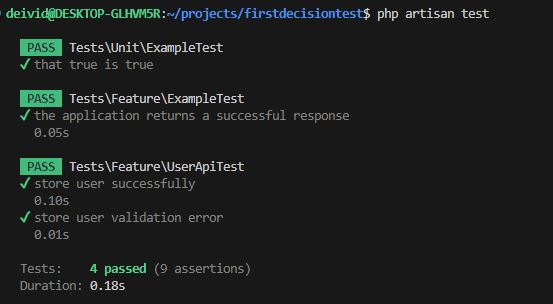

# Projeto para Teste - First Decision Laravel com Livewire

Este repositório contém uma aplicação desenvolvida em **Laravel** com **Livewire** para gerenciamento de usuários. A aplicação inclui operações de **CRUD** (Create, Read, Update, Delete) e foi criada utilizando boas práticas de desenvolvimento e testes. O projeto segue princípios como **SOLID**, **Clean Code** e **Calistenia de Objetos**, aplicando conceitos e patterns conhecidos. A arquitetura utiliza **Services** e **Repositories** para abstrair a lógica de negócios e a camada de acesso a dados. Além disso, a aplicação conta com **Livewire Components**, validações em tempo real, testes unitários e de feature.

### Regra Demonstrativa

Foi implementada uma regra para demonstrar como o sistema valida alterações de senha: 
- Ao editar um usuário e optar por alterar a senha, é necessário informar a **senha atual** e a **nova senha**.
- O back-end verifica se a senha atual corresponde à registrada no banco de dados.

---

## Tecnologias Utilizadas

- **Laravel**: Framework PHP para construção de aplicações web.
- **Livewire**: Biblioteca para criar interfaces dinâmicas sem recarregar a página.
- **PHP**: Linguagem de programação utilizada (versão 8.1).
- **Docker**: Ferramenta de contêinerização.
- **PostgreSQL**: Banco de dados utilizado.

---

## Pré-requisitos

- **Docker**
- **Docker Compose**

---

## Estrutura do Projeto

- **Services**: Contém a lógica de negócios e regras da aplicação.
- **Repositories**: Camada de abstração para o acesso a dados.
- **Livewire Components**: Gerenciam a interação em tempo real com o front-end.
- **Config**: Arquivos de configuração da aplicação.

---

## Configuração e Instalação

### Instalação

1. Clone o repositório: 
   ```bash
   git clone git@github.com:deividscortegagna/firstdecisionteste.git
   cd firstdecisionteste
   ```

2. Copie o arquivo `.env.example` para `.env`: 
   ```bash
   cp .env.example .env
   ```

3. Caso seja a primeira vez que esteja executando o projeto:
   ```bash
   docker run --rm \
       -u "$(id -u):$(id -g)" \
       -v "$(pwd):/var/www/html" \
       -w /var/www/html \
       laravelsail/php83-composer:latest \
       composer install --ignore-platform-reqs
   ```

   Se não for a primeira vez, basta executar:
   ```bash
   docker-compose up -d
   ```

4. Execute as migrações e instale as dependências:
   ```bash
   ./vendor/bin/sail up -d
   ./vendor/bin/sail composer install
   ./vendor/bin/sail artisan migrate
   docker exec -it firstdecisionteste-laravel.test-1 sh
   npm install
   npm run build
   ```

5. Acesse a aplicação: 
   - **Docker com porta 8080**: [http://localhost:8080](http://localhost:8080)
   - **Laravel localmente**: [http://localhost/login](http://localhost/login)

Certifique-se de que o arquivo `docker-compose.yml` ou o servidor Laravel estão configurados corretamente.

---

## Documentação da API

### Endpoints Principais

#### POST `/api/users`

Cria um novo usuário.

**Exemplo em `curl`:**
```bash
curl -X POST http://localhost:8080/api/users -H "Content-Type: application/json" -d '{
    "name": "John Doe",
    "email": "john.doe@example.com",
    "password": "password",
    "password_confirmation": "password"
}'
```

#### PUT `/api/users/{id}`

Atualiza os dados de um usuário.

**Exemplo em `curl`:**
```bash
curl -X PUT http://localhost:8080/api/users/1 -H "Content-Type: application/json" -d '{
    "name": "Jane Doe",
    "email": "jane.doe@example.com",
    "password": "newpassword",
    "password_confirmation": "newpassword"
}'
```

#### GET `/api/user`

Retorna os dados do usuário autenticado (via Sanctum).

**Exemplo em `curl`:**
```bash
curl -X GET http://localhost:8080/api/user -H "Authorization: Bearer <TOKEN>"
```

---

## Rotas Web

- **GET** `/register`: Tela de registro de novos usuários.
- **GET** `/login`: Tela de login.
- **GET** `/dashboard`: Painel principal após login.

---

## Rodando os Testes

Para executar os testes, utilize:
```bash
docker exec -it laravel-app sh
php artisan test
```



---

## Front-end

O front-end foi desenvolvido diretamente com **Livewire** e **Blade Templates**, garantindo maior integração com o Laravel. Rotas como `/register`, `/login` e `/dashboard` utilizam componentes Livewire para interação em tempo real.

---

## TODO

Tarefas planejadas para futuras implementações:
- Implementar autenticação via OAuth com **Laravel Passport**.
- Adicionar **Swagger** para documentação da API.
- Melhorar a customização visual dos componentes Livewire para maior usabilidade.

---

## Autor

**Deivid Willian Scortegagna**
